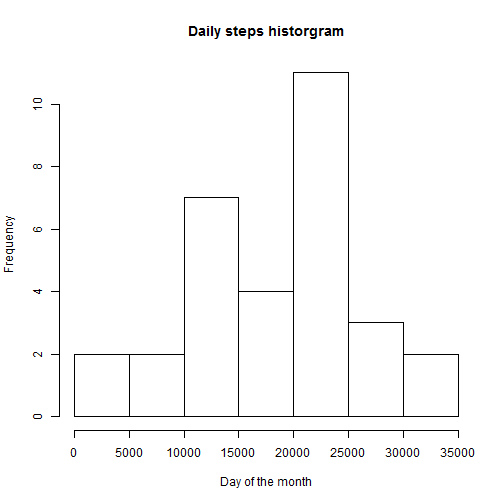
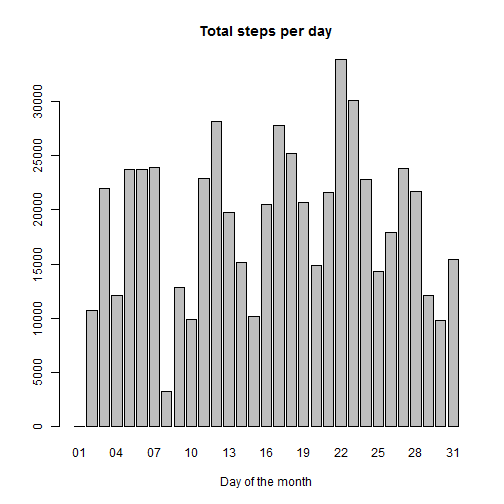
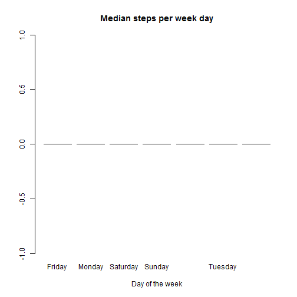
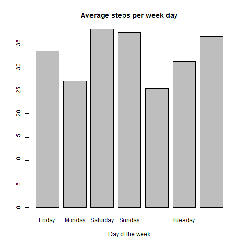
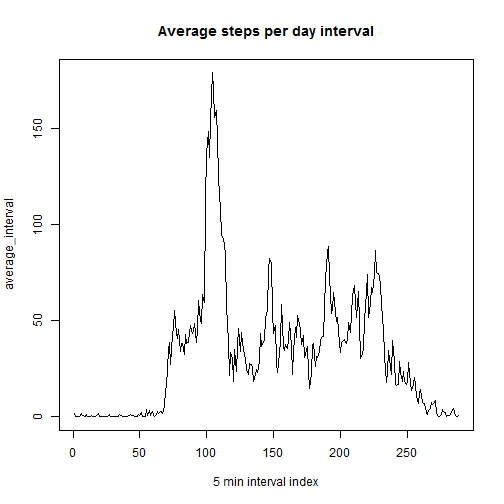
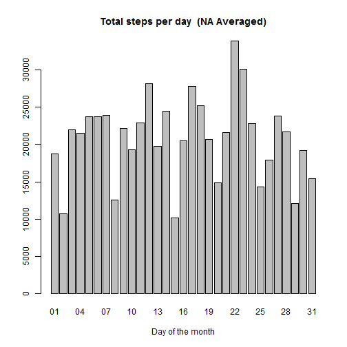
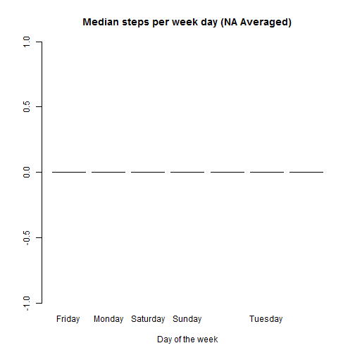
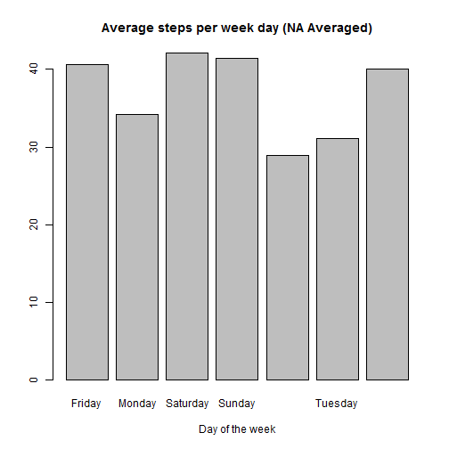
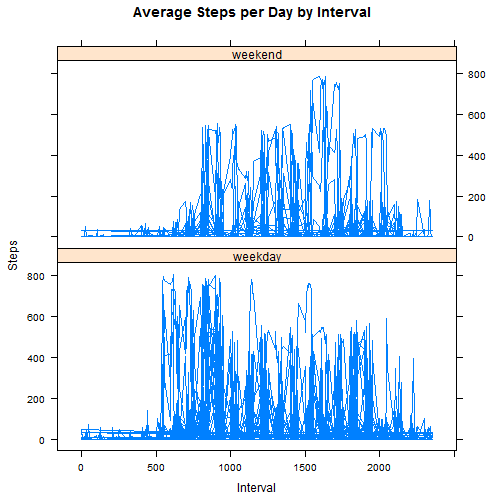

This is the first course project ourput of the reproducable research course by John hopkins, coursera. 
The research is about activity monitoring and in purpose of demonstrating R markdown and Knitr capabiltities by answering a series of questions. 

#Data
The data for this assignment can be downloaded from the course web site:

The variables included in this dataset are:

* steps: Number of steps taking in a 5-minute interval (missing values are coded as NA)
* date: The date on which the measurement was taken in YYYY-MM-DD format
* interval: Identifier for the 5-minute interval in which measurement was taken

The dataset is stored in a comma-separated-

#The Assignment
This assignment will be described in multiple parts. You will need to write a report that answers the questions detailed below. Ultimately, you will need to complete the entire assignment in a single R markdown document that can be processed by knitr and be transformed into an HTML file.

#Preperation
## Load the data 
Load the data and prepare it, assum it is under csv file in current executing directory called activity.csv 

```r
library(lattice)
#load the csv file 
activity_raw <- read.csv("./activity.csv", colClasses = "character")
#make steps,interval as numeric into cleaner data frame  
activity<-activity_raw
activity$steps<-as.numeric(activity_raw$steps)
activity$interval<-as.numeric(activity_raw$interval)
#zero steps for NA measurements 
activity[is.na(activity$steps),]$steps=0
#now parse the date 
activity$date<-as.Date(activity_raw$date, "%Y-%m-%d")
```

## What is mean total number of steps taken per day?

```r
steps_per_day<-tapply(activity$steps, format(activity$date, '%d'), sum) 
hist(steps_per_day, main="Daily steps historgram", 
        xlab="Day of the month")
```



```r
barplot(steps_per_day, main="Total steps per day", 
        xlab="Day of the month")
```


Now some median and mean per week day:


```r
median_steps_per_weekday<-tapply(activity$steps, format(activity$date, '%A'), median) 
mean_steps_per_weekday<-tapply(activity$steps, format(activity$date, '%A'), mean)

barplot(median_steps_per_weekday, main="Median steps per week day", 
        xlab="Day of the week")
```



```r
barplot(mean_steps_per_weekday, main="Average steps per week day", 
        xlab="Day of the week")
```



## What is average daily activity pattern?

```r
average_interval<-tapply(activity$steps, activity$interval, mean) 
plot(average_interval,type="l", main="Average steps per day interval", xlab="5 min interval index")
```



```r
max_interval=max( average_interval )
max_steps=which.max( average_interval )
```

## Imputing missing values


```r
na_activity_rows=activity_raw[is.na(activity_raw$steps)|is.na(activity_raw$date)|is.na(activity_raw$interval),]
```
The total number of rows with NA values:

```
## [1] 2304
```
Since there are many missing values, we are going to smooth the dataset with settign the steps average value for that day to the NA values:


```r
#find the daily average 
average_steps_per_interval_day<-tapply(activity$steps, format(activity$date, '%d'), mean)
#copy the set and overwrite the NAs with the average
activity_smooth=activity_raw
activity_smooth[is.na(activity_smooth$steps),]$steps=mean(activity$steps)
#format rest of the cols
activity_smooth$steps<-as.numeric(activity_smooth$steps)
activity_smooth$interval<-as.numeric(activity_smooth$interval)
activity_smooth$date<-as.Date(activity_smooth$date, "%Y-%m-%d")
```


## What is mean total number of steps taken per day AFTER smoothing NAs?

```r
steps_per_day<-tapply(activity_smooth$steps, format(activity_smooth$date, '%d'), sum) 
barplot(steps_per_day, main="Total steps per day  (NA Averaged)", 
        xlab="Day of the month")
```


Now some median and mean per week day:


```r
median_steps_per_weekday<-tapply(activity_smooth$steps, format(activity_smooth$date, '%A'), median) 
mean_steps_per_weekday<-tapply(activity_smooth$steps, format(activity_smooth$date, '%A'), mean)

barplot(median_steps_per_weekday, main="Median steps per week day (NA Averaged)", 
        xlab="Day of the week")
```



```r
barplot(mean_steps_per_weekday, main="Average steps per week day (NA Averaged)", 
        xlab="Day of the week")
```



## Are there differences in activity patterns between weekdays and weekends?

lets define a factor variable called weekend day that is true if raw is taken on week end time. 


```r
activity_smooth$type<-"weekday"
#mark weekend days
activity_smooth[weekdays(activity_smooth$date)=="Sunday" | weekdays(activity_smooth$date)=="Saturday",]$type<-"weekend"


xyplot(activity_smooth$steps ~ activity_smooth$interval|activity_smooth$type, main="Average Steps per Day by Interval",xlab="Interval", ylab="Steps",layout=c(1,2), type="l")
```


